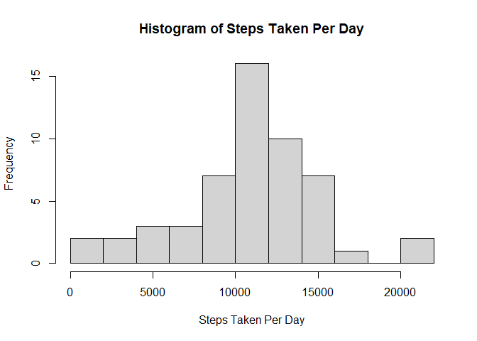
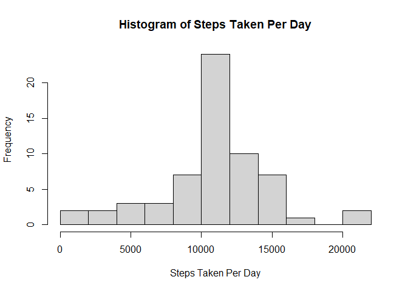
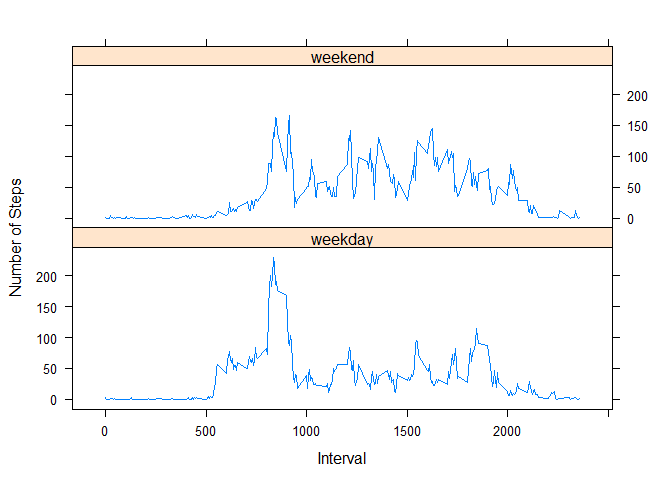

## Loading and preprocessing the data


```r
library(data.table)

raw <- fread("activity.csv")

head(raw[!is.na(steps)])
```

```
##    steps       date interval
## 1:     0 2012-10-02        0
## 2:     0 2012-10-02        5
## 3:     0 2012-10-02       10
## 4:     0 2012-10-02       15
## 5:     0 2012-10-02       20
## 6:     0 2012-10-02       25
```


## What is mean total number of steps taken per day?

Part 1


```r
t.steps <- aggregate( steps~date, raw, sum)
names(t.steps)[2] <- "total.steps"
t.steps
```

```
##          date total.steps
## 1  2012-10-02         126
## 2  2012-10-03       11352
## 3  2012-10-04       12116
## 4  2012-10-05       13294
## 5  2012-10-06       15420
## 6  2012-10-07       11015
## 7  2012-10-09       12811
## 8  2012-10-10        9900
## 9  2012-10-11       10304
## 10 2012-10-12       17382
## 11 2012-10-13       12426
## 12 2012-10-14       15098
## 13 2012-10-15       10139
## 14 2012-10-16       15084
## 15 2012-10-17       13452
## 16 2012-10-18       10056
## 17 2012-10-19       11829
## 18 2012-10-20       10395
## 19 2012-10-21        8821
## 20 2012-10-22       13460
## 21 2012-10-23        8918
## 22 2012-10-24        8355
## 23 2012-10-25        2492
## 24 2012-10-26        6778
## 25 2012-10-27       10119
## 26 2012-10-28       11458
## 27 2012-10-29        5018
## 28 2012-10-30        9819
## 29 2012-10-31       15414
## 30 2012-11-02       10600
## 31 2012-11-03       10571
## 32 2012-11-05       10439
## 33 2012-11-06        8334
## 34 2012-11-07       12883
## 35 2012-11-08        3219
## 36 2012-11-11       12608
## 37 2012-11-12       10765
## 38 2012-11-13        7336
## 39 2012-11-15          41
## 40 2012-11-16        5441
## 41 2012-11-17       14339
## 42 2012-11-18       15110
## 43 2012-11-19        8841
## 44 2012-11-20        4472
## 45 2012-11-21       12787
## 46 2012-11-22       20427
## 47 2012-11-23       21194
## 48 2012-11-24       14478
## 49 2012-11-25       11834
## 50 2012-11-26       11162
## 51 2012-11-27       13646
## 52 2012-11-28       10183
## 53 2012-11-29        7047
```

Part 2


```r
hist(t.steps$total.steps, 
     breaks=15,
     xlab="Steps Taken Per Day", 
     main="Histogram of Steps Taken Per Day")
```

<!-- -->

Part 3 

Total steps per day mean and median


```r
c("mean" = mean(t.steps$total.steps), "median" =median(t.steps$total.steps))
```

```
##     mean   median 
## 10766.19 10765.00
```


## What is the average daily activity pattern?

Part 1


```r
m.interval <-aggregate( steps ~ interval, raw ,mean,na.rm=TRUE)

names(m.interval)[2] <- "meanSteps"

plot(m.interval$interval,m.interval$meanSteps,
     type="l",
     xlab="5-Minute Interval",
     ylab="Mean Steps Taken",
     main="Steps during the Day")
```

<!-- -->
Part 2

```r
 max <- m.interval[  which.max(m.interval$meanSteps), ]
names(max)[2] <- "max.steps"
max
```

```
##     interval max.steps
## 104      835  206.1698
```

```r
 # c("" = m.interval$interval[which.max(m.interval$steps)])
```


## Imputing missing values

Part 1

```r
c ("Number of rows with missing data" = sum(!complete.cases(raw)))
```

```
## Number of rows with missing data 
##                             2304
```

Part 2 & 3


```r
fill <- merge(raw , m.interval, by="interval", sort = F)
fill[is.na(steps)]$steps <- round (fill[is.na(steps), meanSteps])
fill[,meanSteps:=NULL]
fill
```

```
##        interval steps       date
##     1:        0     2 2012-10-01
##     2:        5     0 2012-10-01
##     3:       10     0 2012-10-01
##     4:       15     0 2012-10-01
##     5:       20     0 2012-10-01
##    ---                          
## 17564:     2335     5 2012-11-30
## 17565:     2340     3 2012-11-30
## 17566:     2345     1 2012-11-30
## 17567:     2350     0 2012-11-30
## 17568:     2355     1 2012-11-30
```
Part 4 


```r
t.steps.filled <- aggregate( steps~date, fill, sum)
names(t.steps.filled)[2] <- "total.steps"
t.steps.filled
```

```
##          date total.steps
## 1  2012-10-01       10762
## 2  2012-10-02         126
## 3  2012-10-03       11352
## 4  2012-10-04       12116
## 5  2012-10-05       13294
## 6  2012-10-06       15420
## 7  2012-10-07       11015
## 8  2012-10-08       10762
## 9  2012-10-09       12811
## 10 2012-10-10        9900
## 11 2012-10-11       10304
## 12 2012-10-12       17382
## 13 2012-10-13       12426
## 14 2012-10-14       15098
## 15 2012-10-15       10139
## 16 2012-10-16       15084
## 17 2012-10-17       13452
## 18 2012-10-18       10056
## 19 2012-10-19       11829
## 20 2012-10-20       10395
## 21 2012-10-21        8821
## 22 2012-10-22       13460
## 23 2012-10-23        8918
## 24 2012-10-24        8355
## 25 2012-10-25        2492
## 26 2012-10-26        6778
## 27 2012-10-27       10119
## 28 2012-10-28       11458
## 29 2012-10-29        5018
## 30 2012-10-30        9819
## 31 2012-10-31       15414
## 32 2012-11-01       10762
## 33 2012-11-02       10600
## 34 2012-11-03       10571
## 35 2012-11-04       10762
## 36 2012-11-05       10439
## 37 2012-11-06        8334
## 38 2012-11-07       12883
## 39 2012-11-08        3219
## 40 2012-11-09       10762
## 41 2012-11-10       10762
## 42 2012-11-11       12608
## 43 2012-11-12       10765
## 44 2012-11-13        7336
## 45 2012-11-14       10762
## 46 2012-11-15          41
## 47 2012-11-16        5441
## 48 2012-11-17       14339
## 49 2012-11-18       15110
## 50 2012-11-19        8841
## 51 2012-11-20        4472
## 52 2012-11-21       12787
## 53 2012-11-22       20427
## 54 2012-11-23       21194
## 55 2012-11-24       14478
## 56 2012-11-25       11834
## 57 2012-11-26       11162
## 58 2012-11-27       13646
## 59 2012-11-28       10183
## 60 2012-11-29        7047
## 61 2012-11-30       10762
```


```r
hist(t.steps.filled$total.steps, 
     breaks=15,
     xlab="Steps Taken Per Day", 
     main="Histogram of Steps Taken Per Day")
```

<!-- -->
Total steps per day mean and median


```r
c("mean" = mean(t.steps.filled$total.steps), "median" =median(t.steps.filled$total.steps))
```

```
##     mean   median 
## 10765.64 10762.00
```


We notice that imputing on missing values does not affect the results much


## Are there differences in activity patterns between weekdays and weekends?


```r
fill$weekday<-weekdays(as.Date(fill$date))

fill$dayType <- factor(ifelse(fill$weekday=="Saturday"|fill$weekday=="Sunday", "weekend", "weekday"))

fill
```

```
##        interval steps       date weekday dayType
##     1:        0     2 2012-10-01  Monday weekday
##     2:        5     0 2012-10-01  Monday weekday
##     3:       10     0 2012-10-01  Monday weekday
##     4:       15     0 2012-10-01  Monday weekday
##     5:       20     0 2012-10-01  Monday weekday
##    ---                                          
## 17564:     2335     5 2012-11-30  Friday weekday
## 17565:     2340     3 2012-11-30  Friday weekday
## 17566:     2345     1 2012-11-30  Friday weekday
## 17567:     2350     0 2012-11-30  Friday weekday
## 17568:     2355     1 2012-11-30  Friday weekday
```

```r
r <-aggregate(steps~interval+dayType, fill, mean)
names(r)[3] <- "mean.steps"
r
```

```
##     interval dayType   mean.steps
## 1          0 weekday   2.28888889
## 2          5 weekday   0.40000000
## 3         10 weekday   0.15555556
## 4         15 weekday   0.17777778
## 5         20 weekday   0.08888889
## 6         25 weekday   1.57777778
## 7         30 weekday   0.75555556
## 8         35 weekday   1.15555556
## 9         40 weekday   0.00000000
## 10        45 weekday   1.73333333
## 11        50 weekday   0.35555556
## 12        55 weekday   0.00000000
## 13       100 weekday   0.37777778
## 14       105 weekday   0.13333333
## 15       110 weekday   0.17777778
## 16       115 weekday   0.40000000
## 17       120 weekday   0.00000000
## 18       125 weekday   1.44444444
## 19       130 weekday   2.24444444
## 20       135 weekday   0.00000000
## 21       140 weekday   0.20000000
## 22       145 weekday   0.20000000
## 23       150 weekday   0.31111111
## 24       155 weekday   0.00000000
## 25       200 weekday   0.00000000
## 26       205 weekday   0.00000000
## 27       210 weekday   1.37777778
## 28       215 weekday   0.00000000
## 29       220 weekday   0.00000000
## 30       225 weekday   0.15555556
## 31       230 weekday   0.00000000
## 32       235 weekday   0.26666667
## 33       240 weekday   0.00000000
## 34       245 weekday   0.00000000
## 35       250 weekday   2.08888889
## 36       255 weekday   1.24444444
## 37       300 weekday   0.00000000
## 38       305 weekday   0.00000000
## 39       310 weekday   0.00000000
## 40       315 weekday   0.00000000
## 41       320 weekday   0.00000000
## 42       325 weekday   0.86666667
## 43       330 weekday   1.28888889
## 44       335 weekday   0.57777778
## 45       340 weekday   0.35555556
## 46       345 weekday   0.08888889
## 47       350 weekday   0.00000000
## 48       355 weekday   0.00000000
## 49       400 weekday   0.24444444
## 50       405 weekday   1.24444444
## 51       410 weekday   2.28888889
## 52       415 weekday   0.00000000
## 53       420 weekday   0.40000000
## 54       425 weekday   0.00000000
## 55       430 weekday   3.35555556
## 56       435 weekday   0.26666667
## 57       440 weekday   3.71111111
## 58       445 weekday   0.91111111
## 59       450 weekday   2.33333333
## 60       455 weekday   0.71111111
## 61       500 weekday   0.00000000
## 62       505 weekday   2.11111111
## 63       510 weekday   3.93333333
## 64       515 weekday   2.15555556
## 65       520 weekday   4.17777778
## 66       525 weekday   2.71111111
## 67       530 weekday   2.73333333
## 68       535 weekday   7.93333333
## 69       540 weekday  20.40000000
## 70       545 weekday  23.60000000
## 71       550 weekday  50.28888889
## 72       555 weekday  56.20000000
## 73       600 weekday  41.22222222
## 74       605 weekday  64.55555556
## 75       610 weekday  70.11111111
## 76       615 weekday  77.08888889
## 77       620 weekday  63.93333333
## 78       625 weekday  60.02222222
## 79       630 weekday  66.42222222
## 80       635 weekday  47.93333333
## 81       640 weekday  55.66666667
## 82       645 weekday  54.84444444
## 83       650 weekday  47.00000000
## 84       655 weekday  60.42222222
## 85       700 weekday  50.62222222
## 86       705 weekday  50.77777778
## 87       710 weekday  62.08888889
## 88       715 weekday  69.40000000
## 89       720 weekday  63.11111111
## 90       725 weekday  59.11111111
## 91       730 weekday  66.26666667
## 92       735 weekday  54.31111111
## 93       740 weekday  62.68888889
## 94       745 weekday  83.44444444
## 95       750 weekday  67.75555556
## 96       755 weekday  66.55555556
## 97       800 weekday  82.66666667
## 98       805 weekday  71.93333333
## 99       810 weekday 143.95555556
## 100      815 weekday 182.04444444
## 101      820 weekday 200.55555556
## 102      825 weekday 183.55555556
## 103      830 weekday 198.84444444
## 104      835 weekday 230.35555556
## 105      840 weekday 218.91111111
## 106      845 weekday 185.71111111
## 107      850 weekday 191.17777778
## 108      855 weekday 177.08888889
## 109      900 weekday 167.60000000
## 110      905 weekday 125.77777778
## 111      910 weekday  93.93333333
## 112      915 weekday  87.28888889
## 113      920 weekday 103.57777778
## 114      925 weekday  92.46666667
## 115      930 weekday  58.48888889
## 116      935 weekday  35.82222222
## 117      940 weekday  27.48888889
## 118      945 weekday  40.88888889
## 119      950 weekday  39.13333333
## 120      955 weekday  17.62222222
## 121     1000 weekday  37.93333333
## 122     1005 weekday  18.22222222
## 123     1010 weekday  39.02222222
## 124     1015 weekday  47.86666667
## 125     1020 weekday  30.35555556
## 126     1025 weekday  35.17777778
## 127     1030 weekday  33.08888889
## 128     1035 weekday  24.20000000
## 129     1040 weekday  23.55555556
## 130     1045 weekday  25.86666667
## 131     1050 weekday  22.02222222
## 132     1055 weekday  23.26666667
## 133     1100 weekday  21.64444444
## 134     1105 weekday  25.13333333
## 135     1110 weekday  11.64444444
## 136     1115 weekday  16.33333333
## 137     1120 weekday  24.13333333
## 138     1125 weekday  23.66666667
## 139     1130 weekday  32.71111111
## 140     1135 weekday  50.20000000
## 141     1140 weekday  44.55555556
## 142     1145 weekday  47.97777778
## 143     1150 weekday  50.11111111
## 144     1155 weekday  56.11111111
## 145     1200 weekday  55.73333333
## 146     1205 weekday  72.88888889
## 147     1210 weekday  83.66666667
## 148     1215 weekday  75.31111111
## 149     1220 weekday  48.66666667
## 150     1225 weekday  46.80000000
## 151     1230 weekday  62.51111111
## 152     1235 weekday  30.68888889
## 153     1240 weekday  22.04444444
## 154     1245 weekday  29.35555556
## 155     1250 weekday  32.77777778
## 156     1255 weekday  56.55555556
## 157     1300 weekday  24.55555556
## 158     1305 weekday  25.75555556
## 159     1310 weekday  24.53333333
## 160     1315 weekday  15.64444444
## 161     1320 weekday  35.60000000
## 162     1325 weekday  44.80000000
## 163     1330 weekday  31.80000000
## 164     1335 weekday  23.28888889
## 165     1340 weekday  25.24444444
## 166     1345 weekday  40.24444444
## 167     1350 weekday  25.53333333
## 168     1355 weekday  36.35555556
## 169     1400 weekday  46.95555556
## 170     1405 weekday  39.55555556
## 171     1410 weekday  32.17777778
## 172     1415 weekday  45.08888889
## 173     1420 weekday  27.42222222
## 174     1425 weekday  30.82222222
## 175     1430 weekday  31.51111111
## 176     1435 weekday  14.57777778
## 177     1440 weekday  11.53333333
## 178     1445 weekday  21.97777778
## 179     1450 weekday  41.91111111
## 180     1455 weekday  38.31111111
## 181     1500 weekday  30.86666667
## 182     1505 weekday  35.04444444
## 183     1510 weekday  29.88888889
## 184     1515 weekday  31.93333333
## 185     1520 weekday  39.86666667
## 186     1525 weekday  37.37777778
## 187     1530 weekday  42.11111111
## 188     1535 weekday  50.88888889
## 189     1540 weekday  90.57777778
## 190     1545 weekday  95.91111111
## 191     1550 weekday  93.93333333
## 192     1555 weekday  70.31111111
## 193     1600 weekday  46.86666667
## 194     1605 weekday  45.17777778
## 195     1610 weekday  56.66666667
## 196     1615 weekday  36.11111111
## 197     1620 weekday  26.82222222
## 198     1625 weekday  29.55555556
## 199     1630 weekday  22.53333333
## 200     1635 weekday  21.88888889
## 201     1640 weekday  25.91111111
## 202     1645 weekday  31.93333333
## 203     1650 weekday  27.60000000
## 204     1655 weekday  32.46666667
## 205     1700 weekday  23.62222222
## 206     1705 weekday  44.91111111
## 207     1710 weekday  34.22222222
## 208     1715 weekday  48.04444444
## 209     1720 weekday  60.15555556
## 210     1725 weekday  72.37777778
## 211     1730 weekday  56.15555556
## 212     1735 weekday  65.86666667
## 213     1740 weekday  82.86666667
## 214     1745 weekday  59.40000000
## 215     1750 weekday  34.53333333
## 216     1755 weekday  37.53333333
## 217     1800 weekday  26.68888889
## 218     1805 weekday  46.62222222
## 219     1810 weekday  67.26666667
## 220     1815 weekday  82.60000000
## 221     1820 weekday  61.35555556
## 222     1825 weekday  73.48888889
## 223     1830 weekday  79.26666667
## 224     1835 weekday  81.46666667
## 225     1840 weekday  91.66666667
## 226     1845 weekday 115.40000000
## 227     1850 weekday 101.35555556
## 228     1855 weekday  90.64444444
## 229     1900 weekday  87.57777778
## 230     1905 weekday  77.24444444
## 231     1910 weekday  62.37777778
## 232     1915 weekday  54.33333333
## 233     1920 weekday  37.84444444
## 234     1925 weekday  20.60000000
## 235     1930 weekday  29.04444444
## 236     1935 weekday  45.97777778
## 237     1940 weekday  30.02222222
## 238     1945 weekday  18.64444444
## 239     1950 weekday  44.31111111
## 240     1955 weekday  27.35555556
## 241     2000 weekday  13.44444444
## 242     2005 weekday   5.55555556
## 243     2010 weekday   6.77777778
## 244     2015 weekday  14.06666667
## 245     2020 weekday   8.73333333
## 246     2025 weekday   5.68888889
## 247     2030 weekday   9.73333333
## 248     2035 weekday   7.11111111
## 249     2040 weekday   9.02222222
## 250     2045 weekday  13.06666667
## 251     2050 weekday  25.93333333
## 252     2055 weekday  17.28888889
## 253     2100 weekday  11.37777778
## 254     2105 weekday  18.86666667
## 255     2110 weekday  28.44444444
## 256     2115 weekday  18.91111111
## 257     2120 weekday  14.22222222
## 258     2125 weekday   8.04444444
## 259     2130 weekday  12.84444444
## 260     2135 weekday  16.46666667
## 261     2140 weekday   7.17777778
## 262     2145 weekday   7.62222222
## 263     2150 weekday   8.24444444
## 264     2155 weekday   3.48888889
## 265     2200 weekday   1.46666667
## 266     2205 weekday   4.46666667
## 267     2210 weekday   6.33333333
## 268     2215 weekday  11.22222222
## 269     2220 weekday   9.26666667
## 270     2225 weekday  10.88888889
## 271     2230 weekday  12.82222222
## 272     2235 weekday   2.86666667
## 273     2240 weekday   0.00000000
## 274     2245 weekday   0.13333333
## 275     2250 weekday   1.95555556
## 276     2255 weekday   2.06666667
## 277     2300 weekday   3.51111111
## 278     2305 weekday   3.75555556
## 279     2310 weekday   0.00000000
## 280     2315 weekday   1.11111111
## 281     2320 weekday   1.26666667
## 282     2325 weekday   1.93333333
## 283     2330 weekday   3.08888889
## 284     2335 weekday   2.28888889
## 285     2340 weekday   2.20000000
## 286     2345 weekday   0.31111111
## 287     2350 weekday   0.26666667
## 288     2355 weekday   1.40000000
## 289        0 weekend   0.25000000
## 290        5 weekend   0.00000000
## 291       10 weekend   0.00000000
## 292       15 weekend   0.00000000
## 293       20 weekend   0.00000000
## 294       25 weekend   3.50000000
## 295       30 weekend   0.12500000
## 296       35 weekend   0.12500000
## 297       40 weekend   0.00000000
## 298       45 weekend   0.50000000
## 299       50 weekend   0.00000000
## 300       55 weekend   0.43750000
## 301      100 weekend   0.00000000
## 302      105 weekend   2.37500000
## 303      110 weekend   0.00000000
## 304      115 weekend   0.00000000
## 305      120 weekend   0.00000000
## 306      125 weekend   0.12500000
## 307      130 weekend   0.75000000
## 308      135 weekend   0.56250000
## 309      140 weekend   0.00000000
## 310      145 weekend   0.68750000
## 311      150 weekend   0.00000000
## 312      155 weekend   0.00000000
## 313      200 weekend   0.00000000
## 314      205 weekend   0.00000000
## 315      210 weekend   0.37500000
## 316      215 weekend   0.00000000
## 317      220 weekend   0.00000000
## 318      225 weekend   0.00000000
## 319      230 weekend   0.00000000
## 320      235 weekend   0.00000000
## 321      240 weekend   0.00000000
## 322      245 weekend   0.00000000
## 323      250 weekend   0.25000000
## 324      255 weekend   0.12500000
## 325      300 weekend   0.00000000
## 326      305 weekend   0.00000000
## 327      310 weekend   0.00000000
## 328      315 weekend   0.00000000
## 329      320 weekend   0.68750000
## 330      325 weekend   0.12500000
## 331      330 weekend   2.75000000
## 332      335 weekend   0.81250000
## 333      340 weekend   0.62500000
##  [ reached 'max' / getOption("max.print") -- omitted 243 rows ]
```

```r
library(lattice)
xyplot(r$mean.steps ~ r$interval|r$dayType,
       r,
       type="l",
       layout=c(1,2),
       xlab="Interval",
       ylab="Number of Steps")
```

<!-- -->
